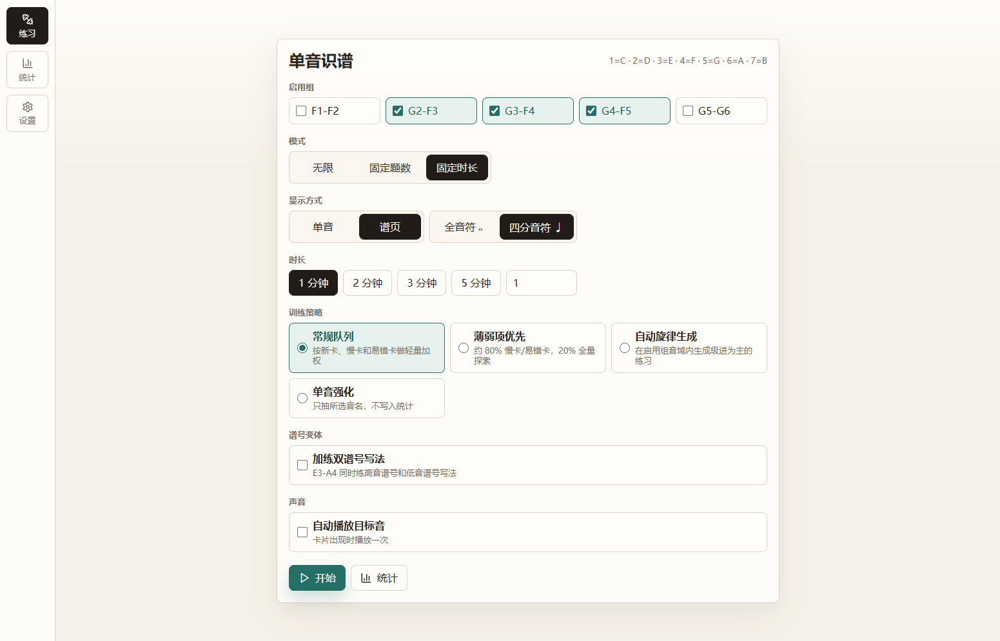
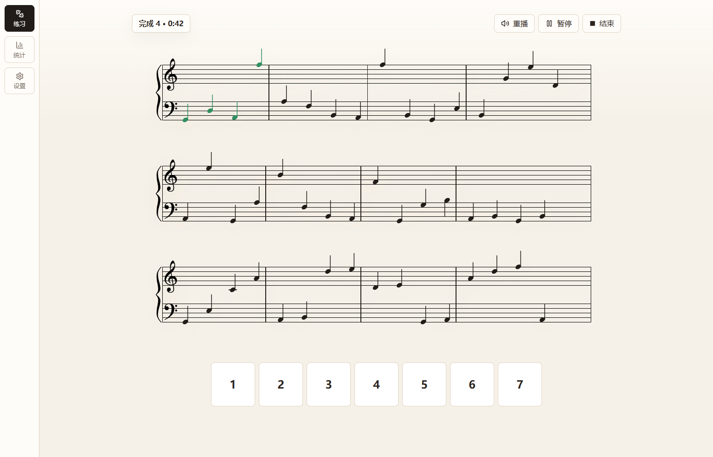
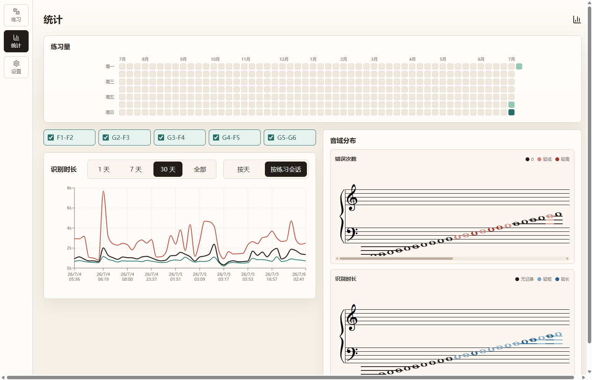

# 单音识谱

钢琴五线谱单音识谱练习工具。练习记录保存在浏览器本地，可按音区、谱表间加线写法和训练策略安排练习；学习页还支持按音名默写全部谱位并比较历次完成时间。

<details name="screenshots" open>
<summary>练习设置</summary>



</details>

<details name="screenshots">
<summary>练习中</summary>



</details>

<details name="screenshots">
<summary>统计</summary>



</details>

## 运行

Windows 本机可直接双击 `start.bat`。

也可以用 pnpm 启动：

```bash
corepack enable pnpm
pnpm install
pnpm run dev
```

## 常用命令

```bash
pnpm test
pnpm run build
```

## 部署

推送到 `main` 后，GitHub Actions 会构建 `dist` 并部署到 GitHub Pages。
