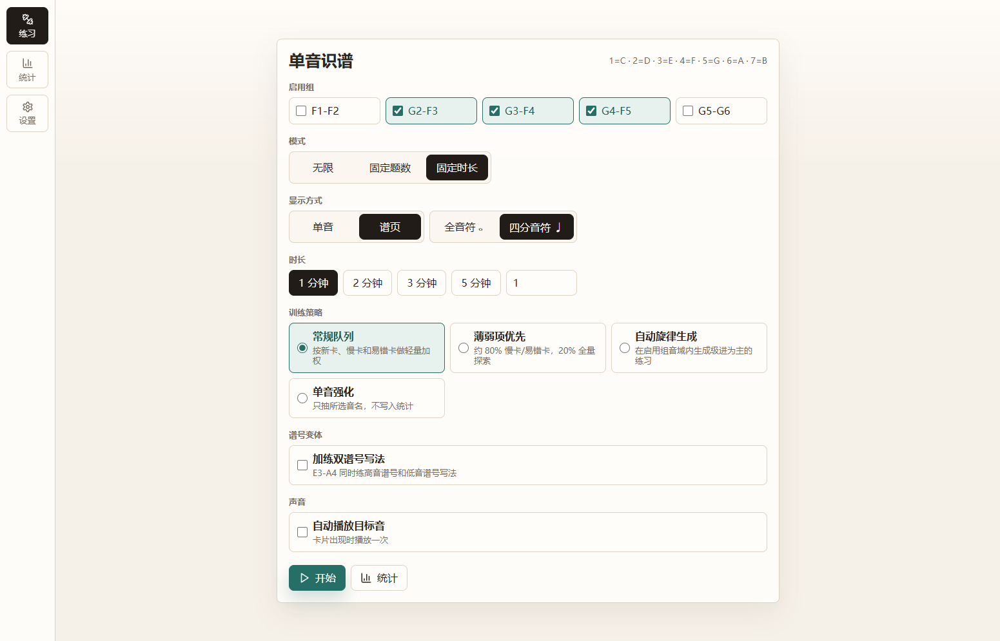
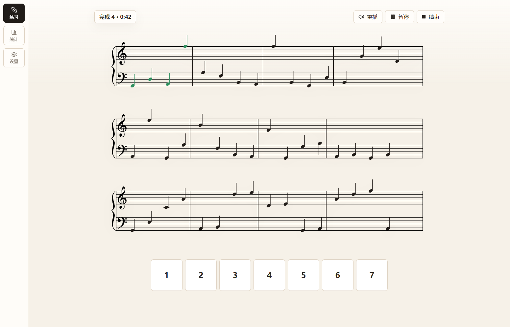
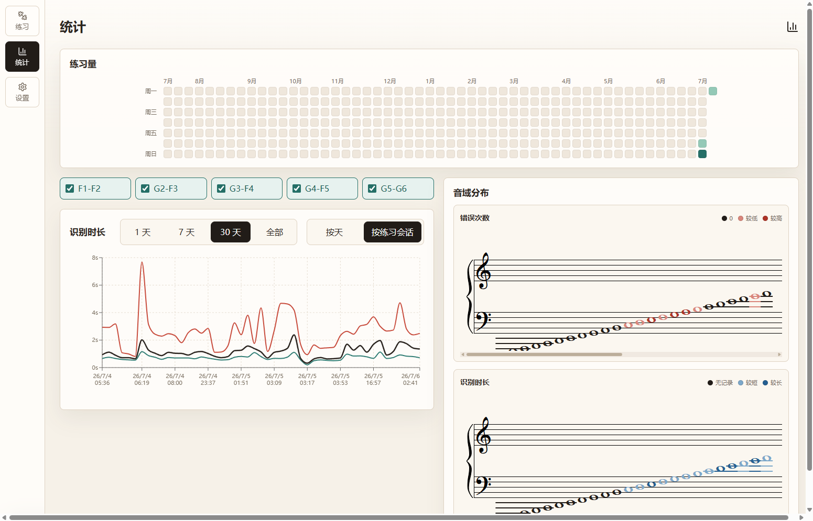

# 单音识谱

钢琴五线谱单音识谱练习工具。练习记录保存在浏览器本地，可按音区、谱表间加线写法和训练策略安排练习；学习页还支持按音名默写全部谱位并比较历次完成时间。

<details name="screenshots" open>
<summary>练习设置</summary>



</details>

<details name="screenshots">
<summary>练习中</summary>



</details>

<details name="screenshots">
<summary>统计</summary>



</details>

## 运行

Windows 本机可直接双击 `start.bat`。

也可以用 pnpm 启动：

```bash
corepack enable pnpm
pnpm install
pnpm run dev
```

## MIDI 键盘

在“设置 → MIDI 键盘”中授权并选择输入设备。连接后可在练习前选择：

- `只认音名`：电脑数字键、屏幕琴键和 MIDI 可同时作答，MIDI 不限八度；
- `精确音高`：只接受 MIDI 输入，音名与八度都必须和谱面一致。设备断开时练习会自动暂停。

连接后还可在练习设置页或结果页按 C4 开始。设备测试、按键生命周期和历史分组规则见 [MIDI 输入说明](docs/midi-input.md)。

## 常用命令

```bash
pnpm test
pnpm run build
```

## 开发文档

- [MIDI 输入与答题判定](docs/midi-input.md)
- [练习历史比较规则](docs/practice-comparison.md)
- [答对进度图规则](docs/session-progress.md)
- [自动旋律生成规则](docs/melody-generation.md)
- [UI 手调位置速查](docs/ui-tuning.md)

## 部署

推送到 `main` 后，GitHub Actions 会构建 `dist` 并部署到 GitHub Pages。
