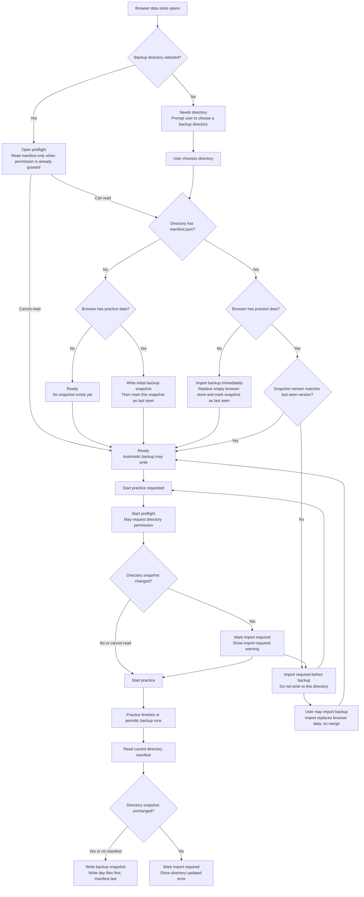

# Guarded backup import without merge

Backup directories are guarded snapshots, not two-way merge stores. Before a browser data store writes to a selected backup directory, it must verify that the directory's backup snapshot version matches the version last imported into that browser; when the directory has advanced, the browser must import from the backup directory before writing. Divergent browser data stores are not merged because review/session conflict policy is not part of the current product model.

## State model

## Write guard

The backup writer treats `manifest.json` as the commit marker for the directory snapshot. It writes day files first and writes `manifest.json` last. Before writing, it reads the current directory manifest and compares its snapshot version with the version last imported or written by the current browser data store.

If the directory has advanced, the browser data store enters the import-required state. New practice data remains only in the current browser data store until the learner imports the backup directory, and import replaces the browser data store instead of merging.

## Preflight

Open preflight is quiet: it checks the selected backup directory only when the browser already has permission to read the directory handle. It does not trigger a permission prompt on page load.

Start preflight runs when the learner starts a practice session. It may request directory permission because the learner has initiated an action. If the directory has advanced, the app shows the import-required warning before practice starts; the learner may still continue, but the next backup write remains blocked until import.

## Non-goal

Day-level or review-level merging is not part of this model. A same-day overwrite policy would still need conflict rules for sessions, reviews, and settings, and could silently discard data from one browser data store. The current safe rule is: one browser data store may write only after it has imported or written the directory's current snapshot version.
